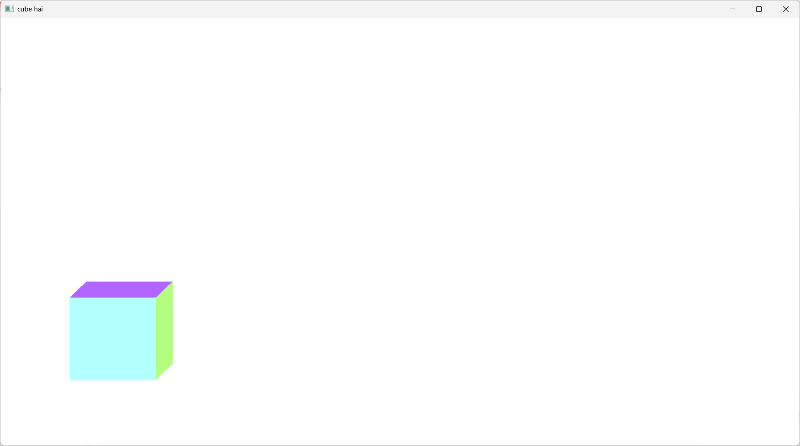
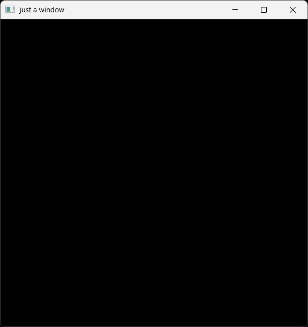
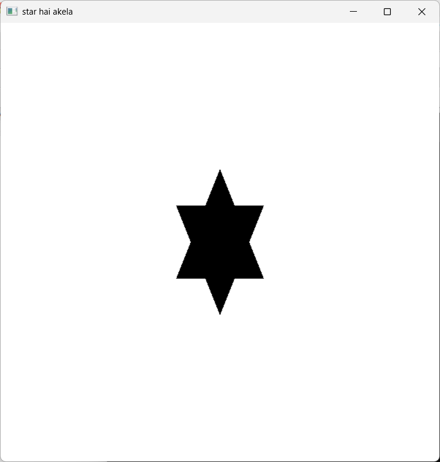
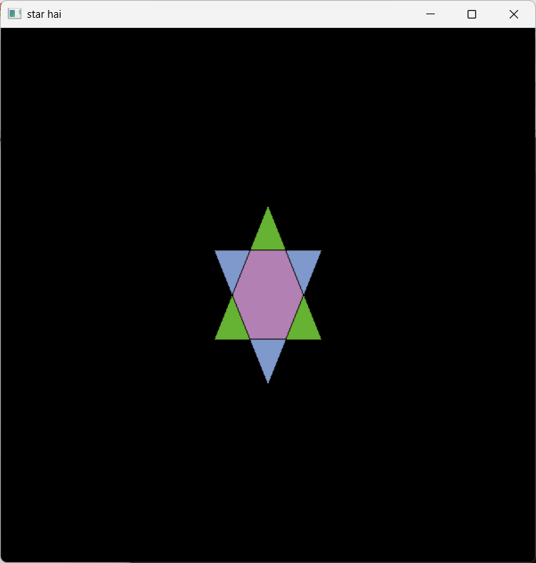
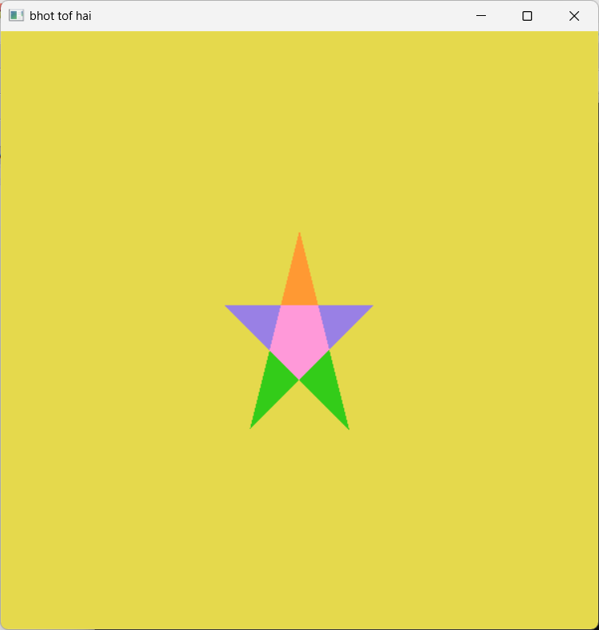
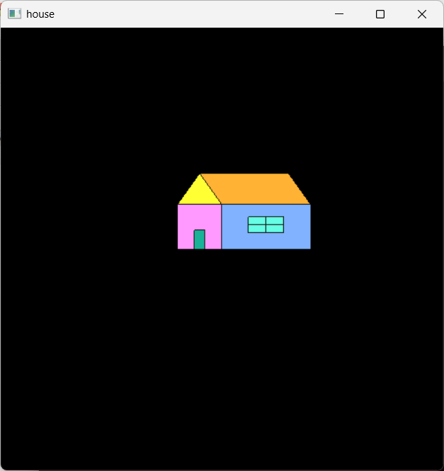
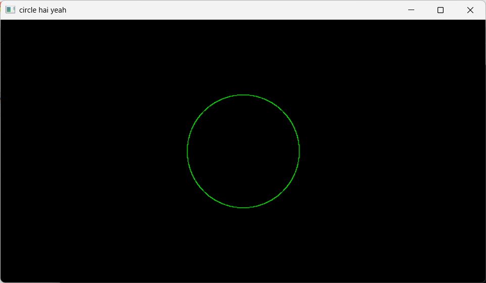
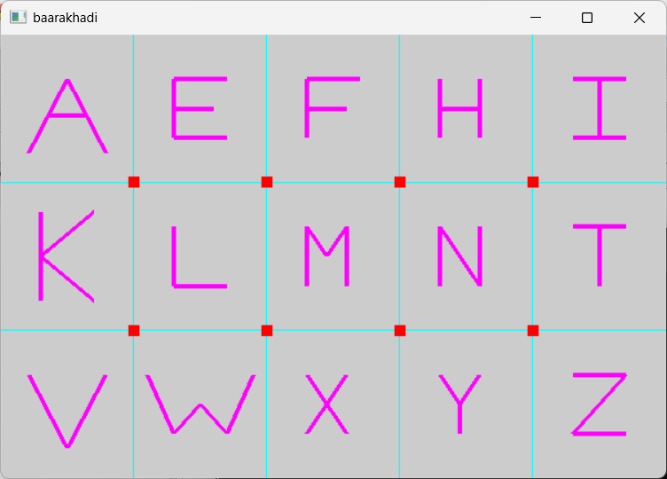

basic programs to practice computer graphics using opengl

## Installation

- to run these codes on your machine follow [this](https://medium.com/swlh/setting-opengl-for-windows-d0b45062caf) guide

## Code Outputs

- [cube.cpp](./programs/cube.cpp)\
    

- [simple_window](./programs/simple_window.cpp)\
    

- [arithmetic_operators](./programs/arithmetic_operators.cpp)\
    

- [star1.cpp](./programs/star1.cpp)\
    

- [star6](./programs/star6.cpp)\
    

- [star5](./programs/star5.cpp)\
    

- [house.cpp](./programs/house.cpp)\
    

- [circle](./programs/circle.cpp)\
    

- [linear_alphabets](./programs/linear_alphabets.cpp)\
    